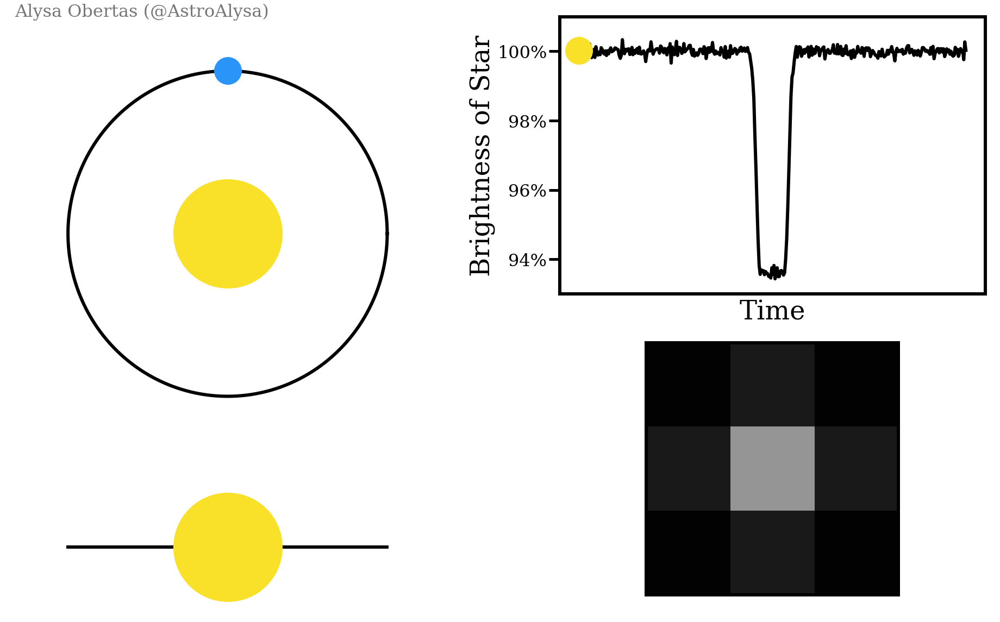

# PeriodyX — Exoplanet Detection Pipeline

ISRO BAH 2026 — Problem Statement #07: AI-enabled Detection of Exoplanets from Noisy Astronomical Light Curves

**Team:** PeriodyX
**Goal:** Build a robust, interpretable, end-to-end machine learning pipeline to detect exoplanets from raw astronomical light curves, strictly avoiding data leakage and prioritizing physical priors over black-box shape matching.

---

## Domain Background (How it works)

To find exoplanets, we monitor the brightness of stars over time. When a planet passes in front of its host star (a "transit"), it temporarily blocks a fraction of the star's light. This creates a periodic, box-shaped dip in the star's light curve:



A detected periodic dip signal is called a **Threshold Crossing Event (TCE)**. A TCE is characterized by three main parameters:
- **Period**: The number of days between each occurrence of the detected signal.
- **Duration**: The time elapsed by each occurrence of the signal.
- **Epoch**: The time of the first observed occurrence of the signal.

Our goal is to build a machine learning model that classifies whether a given TCE is a genuine planet transit or a false positive caused by another astronomical phenomenon — most commonly an eclipsing binary star or background stellar contamination (a "blend").

---

## 1. What This Project Does

This is an end-to-end pipeline that takes raw stellar brightness measurements (light curves) from NASA's Kepler/TESS missions and automatically:

1. **Detrends the signal** — removes instrumental noise and stellar variability while preserving genuine transit signal.
2. **Searches for periodicity** — scans for box-shaped dips that indicate a transiting planet, using a fast/slow tiered search.
3. **Fits a physical model** — a trapezoid fit characterizes each detected dip's depth, duration, and ingress/egress time.
4. **Extracts physical priors and features** — pulls independent stellar properties (radius, temperature) and centroid motion (pixel-level positional shift) directly from archival data.
5. **Classifies each detection (XGBoost)** into one of four categories:
   - **transit** — a real planet
   - **eclipsing_binary** — two stars orbiting each other
   - **blend** — contamination from a background source
   - **other** — noise, starspots, or instrumental artifacts

**Design philosophy:** unlike many published systems (e.g. AstroNet) that rely on NASA's proprietary detection pipeline to isolate signals before feeding them into a classifier, PeriodyX owns the entire chain end-to-end — detection through classification — using physically interpretable features rather than a black-box network, and runs on a single commodity machine with no GPU required.

---

## 2. Tech Stack

- **Language:** Python 3
- **Data acquisition:** `lightkurve` (MAST archive access), `urllib` (NASA Exoplanet Archive TAP API)
- **Detrending:** `wotan` (biweight filter)
- **Periodic search:** `astropy.timeseries.BoxLeastSquares`, `transitleastsquares`
- **Shape fitting:** `lmfit` (non-linear least squares)
- **Classification:** `xgboost`, `scikit-learn`, `optuna` (hyperparameter search)
- **Data handling:** `pandas`, `numpy`
- **Model persistence:** `joblib`
- **Web backend:** `FastAPI`, `uvicorn`
- **Deployment:** Hugging Face Spaces (Docker), GitHub

---

## 2b. Interactive Web Application

The pipeline is deployed as a full-stack web application on Hugging Face Spaces.

**Architecture:**
- **Backend (`main.py`):** FastAPI loads the v4 `.joblib` model at startup and exposes two endpoints:
  - `POST /api/run_synthetic` — generates a synthetic Kepler-like light curve, runs the full pipeline, and returns classification probabilities plus a 3-panel visualization.
  - `POST /api/run_custom` — accepts a user-uploaded CSV (`time`, `flux` columns) plus astrophysical priors (stellar radius, temperature, etc.), runs the same pipeline, and returns results.
- **Frontend (`static/`):** a dark glassmorphism UI in vanilla HTML/CSS/JS, with animated pipeline step indicators, per-class confidence bars, and a physical diagnostics grid.
- **No core pipeline changes:** `pipeline.py` and all core modules are untouched by the web layer. The backend only *calls* the pipeline and forwards results to the frontend.

---

## 3. Pipeline Architecture

```text
Raw Light Curve (Kepler/TESS, via MAST)
        |
        v
  [1] DETRENDING (wotan, biweight filter)
        |--------------------------------------------+
        v                                            v
  [2] PERIODIC SEARCH -- tiered                [2b] SINGLE-TRANSIT SCAN
        BLS (fast triage, runs on every star)       (Sliding window matched filter
              |                                      for non-repeating long-period
              v  (if BLS > noise floor)              dips)
        TLS (slow, high-sensitivity refinement)      |
        |                                            v
        v                                         (Flagged for human review)
  [3] SHAPE CHARACTERIZATION (lmfit)
        -> Fits depth, duration, ingress/egress
        |
        v
  [4] FEATURE ENGINEERING & PHYSICAL PRIORS (the "v4" architecture)
        -> 1D shape features (SNR, odd-even depth diff, secondary eclipse)
        -> Independent stellar priors (radius, temperature, gravity, magnitude)
        -> Centroid motion (pixel-level offset magnitude)
        |
        v
  [5] CLASSIFICATION ENSEMBLE (N=20 XGBoost models)
        -> Outputs class probabilities (transit / EB / blend / other)
        -> Bootstrap Uncertainty Bounds (± std dev)
```

---

## 4. The Evolution of the Pipeline (Version History & Data Leakage)

Building an astronomical ML pipeline is notoriously susceptible to **data leakage** — where the model secretly learns human vetting confidence rather than actual physics. This section documents how the pipeline was iteratively debugged, in the order the problems were actually found.

### v1: The Pure Shape Baseline
- **Approach:** 13 pure geometric features extracted from the light curve (depth, duration, odd-even depth difference, secondary eclipse depth).
- **Result:** ~40–46% F1-macro.
- **Finding:** 1D shape is fundamentally degenerate. A background eclipsing binary (blend) can look mathematically identical to a small transiting planet in shape alone. The physical information needed to separate them simply isn't present in a 1D light curve.

### v2/v3: The Leakage Trap
- **Approach:** Added NASA's own vetting flags (`fpflag_*`) and NASA-computed planetary radius (`koi_prad`) to try to break the v1 plateau.
- **Result:** F1-macro jumped to ~98%.
- **The catch:** this was leakage, not signal. `fpflag_*` are literally the flags NASA used to assign the disposition label — training on them is training on the answer key. `koi_prad` was more subtle: NASA only computes a tightly-constrained radius (small error bars) when *already confident* a candidate is a real planet — missingness and error-bar width were both found to correlate directly with disposition. Optuna's hyperparameter search responded by building an ~800-tree forest specifically to memorize these error-bar signatures rather than learning any astrophysics.
- **Action:** stripped `fpflag_*` and `koi_prad` entirely. F1 returned to the honest ~46% baseline.

### v4: Physical Priors & Centroid Tracking
- **Approach:** if NASA's vetting-derived confidence can't be used, the fix is real, independent physics:
  1. **Independent stellar priors** — radius (`koi_srad`), temperature (`koi_steff`), surface gravity (`koi_slogg`), magnitude (`koi_kepmag`).
  2. **Centroid motion** — `koi_dicco_mra` and `koi_dicco_mdec` combined into a single offset magnitude, measuring whether the photometric centroid shifts during the transit. A real shift is the direct physical signature of a background blend.
- **Leakage check on the new inputs, before trusting them:**
  - Missingness in stellar/centroid parameters correlates heavily with false-positive dispositions (as with `koi_prad`). Rather than imputing — which would let the model learn "NaN = false positive" — **670 rows (9.0%) with missing stellar or centroid data were dropped entirely.** This drop was itself non-random: transit −0.5%, eclipsing binary −4.8%, blend −9.4%, other −35.7%. Reported here explicitly because a large, uneven drop like this changes class balance and deserves scrutiny, not silent acceptance.
  - **Centroid error columns checked directly** (`koi_dicco_mra_err`, `koi_dicco_mdec_err`), the same test applied to `koi_prad`: confirmed planets showed ~155% median relative error, false positives ~55%. Initially this looks like the same pattern as the `koi_prad` leak — until you account for the physics. A true planet has *zero* real centroid shift, so any measured value is pure pixel noise, and relative error mathematically explodes when dividing by a true value near zero. A blend has a real, larger shift, so the same absolute noise produces a much smaller relative error. This is the opposite direction from the `koi_prad` leak and is fully explained by measurement statistics rather than vetting confidence — the centroid data was judged clean.

**Ablation studies run to isolate what actually drove the improvement:**
- *v3 baseline, re-run on the exact same pruned (post-drop) dataset:* F1-macro 0.46 — confirming the gain wasn't just from removing 35% of the noisy `other` class.
- *v4 feature set minus `reconstructed_prad`:* CV F1-macro 0.648, versus 0.645 with it included. `reconstructed_prad` is mathematically derived from `depth` (already a feature) and contributes no independent signal once centroid motion is present — the model routes the same information through `depth`/`depth_snr` instead. **`reconstructed_prad` is being dropped from the production feature set** as a result: it adds complexity and a collinear feature without adding predictive value.

**Hyperparameter sanity check:** Optuna's v4 search converged on `n_estimators=204, max_depth=8, learning_rate=0.11` — a regularized, moderate configuration, in contrast to the ~800-tree, depth-9 forest Optuna built during the `koi_prad` leak to memorize noise. This pattern (small, stable model finding a solution vs. a huge model needing to overfit) is treated here as a standing diagnostic, not a one-time check — worth re-running on every future feature-set change.

---

## 5. Final Results (v4)

**Overall held-out test accuracy: 73%** (F1-macro 0.66; 5-fold CV F1-macro 0.645 ± 0.010)

| Class | Precision | Recall | F1-Score | v1/v3 Baseline F1 | Improvement |
|---|---|---|---|---|---|
| Transit (Planet) | 0.87 | 0.89 | **0.88** | 0.62 | +0.26 |
| Eclipsing Binary | 0.81 | 0.65 | **0.72** | 0.65 | +0.07 |
| Blend | 0.56 | 0.65 | **0.61** | 0.33 | +0.28 |
| Other | 0.40 | 0.49 | **0.44** | 0.32 | +0.12 |

### Why it worked

1. **Centroid offset magnitude is the single most important feature (17.4%)** — by a wide margin over every other feature, including the physically well-motivated stellar priors. It directly targets the blend degeneracy that 1D shape alone cannot resolve, and nearly doubled `blend` F1 (0.33 → 0.61).
2. **The original v1 shape-discriminator features (`odd_even_depth_diff`, `secondary_eclipse_depth`) fell to the bottom of the importance ranking (~3%)**, effectively superseded by the physical priors. This is a genuine, interesting finding in its own right: hand-engineered shape heuristics were a reasonable starting point, but independent physical measurements of the star and its surrounding pixels turned out to carry far more separating power than any shape refinement could.
3. **`reconstructed_prad` contributes negligibly once centroid data is present** (confirmed via ablation) and has been dropped from the production feature set for that reason.

### What's still open, stated plainly rather than left implicit
- `blend` and `other` remain the hardest classes (F1 0.61 and 0.44) — real improvement over v1/v3, but not solved. Some part of this is likely an unavoidable physical degeneracy (a faint blend and a faint real transit can look nearly identical even with centroid data, if the offset is below the pixel-noise floor).
- The held-out test F1 (0.66) came in slightly *above* the 5-fold CV F1 (0.645) — an unusual direction, since test performance is normally slightly below CV. Most likely ordinary split variance given a single 20% held-out split, but not yet independently reconfirmed with repeated splits.
- This model is trained and validated entirely on the **Kepler KOI cumulative table** — a public catalogue used specifically because ISRO's own curated dataset and the TOI catalogue are not accessible before selection. Recalibrating on ISRO's real dataset, once released, is a required step before this can be considered the final deliverable for the hackathon itself, even though the pipeline and feature architecture are expected to carry over unchanged.

---

## 6. How to Recreate the Pipeline

### Step 0: Clone and Setup
```bash
git clone https://github.com/rsd-06/periodyx-exoplanet-pipeline.git
cd periodyx-exoplanet-pipeline
pip install -r requirements.txt
```

### Step 1: Download the KOI Data (Label Source)
Downloads the Kepler KOI Cumulative Table, including the physical columns required for v4 (`koi_srad`, centroid motion, etc.).
```bash
python -c "import urllib.request; urllib.request.urlretrieve('https://exoplanetarchive.ipac.caltech.edu/TAP/sync?query=select+kepid,kepoi_name,koi_disposition,koi_srad,koi_steff,koi_slogg,koi_kepmag,koi_dicco_mra,koi_dicco_mdec,koi_fpflag_nt,koi_fpflag_ss,koi_fpflag_co,koi_fpflag_ec,koi_period,koi_duration,koi_depth+from+cumulative&format=csv', 'data/koi_cumulative.csv')"
```

### Step 2: Mechanical Sanity Check
Runs the pipeline entirely on synthetic, locally generated data to confirm the environment (lightkurve, wotan, XGBoost) is functioning correctly.
```bash
python3 scripts/validate_fixes.py
```

### Step 3: Threshold Calibration
Phase-scrambles real Kepler data to establish an empirical noise floor, determining the Signal Detection Efficiency (SDE) threshold required to trigger TLS.
```bash
python3 scripts/calibrate_threshold.py --koi-csv data/koi_cumulative.csv --sample 150
```

### Step 4: Build the Training Set
The heavy step. Downloads raw FITS light curves from MAST, detrends, searches, fits trapezoids, and exports the shape + physical-prior feature table.
```bash
python3 scripts/build_training_set.py --koi-csv data/koi_cumulative.csv --bls-threshold 10.77 --workers 8
```
*(Replace `10.77` with your own calibrated threshold from Step 3. This step takes hours for the full 7,000+ star dataset.)*

### Step 5: Train the Classifier (v4)
Merges extracted shape features with NASA archival stellar priors, drops rows with missing physical data (MNAR-safe), optimizes hyperparameters via Optuna, and trains the N=20 bootstrap ensemble for uncertainty quantification.
```bash
python3 scripts/train_classifier.py --features data/training_features.csv --optuna-trials 50
```

### Step 6: Deploy (Optional)
```bash
export HF_TOKEN="your_token"
python3 upload_model.py
```

---

## 7. Key Learnings

1. **Beware the proxy.** If an archival column was generated by a human-in-the-loop vetting process (like NASA computing tight error bars only for confident planet candidates), a model will exploit it if given the chance — regardless of whether that was the intent.
2. **Missing data is signal.** Dropping missing rows is costly, but imputing physical properties (like stellar radius) risks teaching a model "NaN = false positive" instead of teaching it physics. In this domain, silently filling gaps is not a neutral choice.
3. **A leakage check has to look at more than presence/absence.** Confirming a feature isn't *missing* in a biased way is necessary but not sufficient — its *precision* (error bars, relative uncertainty) can carry the same bias even when the value itself is present, as seen with both `koi_prad` and (initially, before the physical explanation held up) the centroid data.
4. **Physics beats geometry, but not every physically-motivated feature earns its place.** Centroid motion broke a real degeneracy that shape alone couldn't. Reconstructed radius, despite being equally well-motivated physically, turned out to be redundant once centroid was present — ablation testing, not intuition, is what caught that.